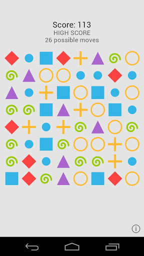
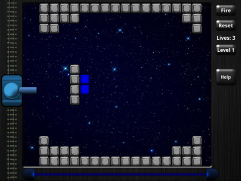

# Kivy
## Cross-Platform GUI In Python

<!---->


[Amit Kotlovski](mailto:amit@amitkot.com) / [@amitkot](http://twitter.com/amitkot)


## Me

- Instructor
- Teach IT Courses at John Bryce
- Android / Python / Java


# Agenda

- GUI in Python
- Kivy Features
- Programming with Kivy
- Demo
- Kivy Open Issues


## Python

```python
class Greetings(object):
    def say_hello(self):
        print('Hello and welcome to the Kivy Presentation!')

g = Greetings()
g.say_hello()
```


## GUI in Python

- [ tkinter ](http://wiki.python.org/moin/TkInter) (thin layer over tcl/tk)
- [ wxPython ](http://www.wxpython.org/) (wxWidgets)
- [ PySide ](https://qt-project.org/wiki/PySide) (QT)
- [ PyGTK ](https://qt-project.org/wiki/PySide) (GTK)
- [ Kivy ](http://kivy.org)


## Let's Talk about Kivy


## Cross-Platform

Linux, Mac OS X, Windows, Android, iOS


## LGPL3 License

Good for Businesses


## Stable and Documented

- [ Programming Guide ](http://kivy.org/docs/guide-index.html)
- [ Tutorials ](http://kivy.org/docs/tutorials-index.html)
- [ API ](http://kivy.org/docs/api-index.html)


## GPU Accelerated

Buit over OpenGL ES 2


# Programming with Kivy


## Hello, Kivy!

```python
from kivy.app import App
from kivy.uix.button import Button

class MyApp(App):
    def build(self):
        return Button(text='Hello, Kivy!')

if __name__ == '__main__':
    MyApp().run()
```


## Hello Kivy (2)

```python
# main.py
from kivy.app import App
from kivy.uix.boxlayout import BoxLayout

class MyLayout(BoxLayout):
    pass

class MyApp(App):
    def build(self):
        return MyLayout()

if __name__ == '__main__':
    MyApp().run()
```
```python
# my.kv
<MyLayout>:
    Button:
        text: 'Left'
    Button:
        text: 'Right'
```


## Demo

- Pong
- Paint
- Particle Panda


## Game On Google Play



[ Match 3 ](https://play.google.com/store/apps/details?id=net.mechanicalcat.match3)


## Game On Apple's iTunes



[ Deflectouch ](https://play.google.com/store/apps/details?id=net.mechanicalcat.match3)


## Packaging for Mobile

- Embed Python and dependencies inside the Package
 - ⇒ Package size is increased (>6mb on Android)
- Enables accessing the native API
- Build tool cross-compiles the app for the mobile platform


# Open Issues

- Mobile Packaging is a WIP, supporting only ARM at the moment
- Mobile App size is rather big (>6mb)
- No GUI Designer (planned for next Google Summer of Code)


# Summary

- Kivy is an interesting option for developing GUI
- Cross Platform support direct from the box
- Good for products and prototypes


# Links

- Website - http://kivy.org
- Source - http://github.com/kivy/kivy
- IRC - #Kivy on irc.freenode.net


# Questions


# Thanks!

[Amit Kotlovski](mailto:amit@amitkot.com) / [@amitkot](http://twitter.com/amitkot)
